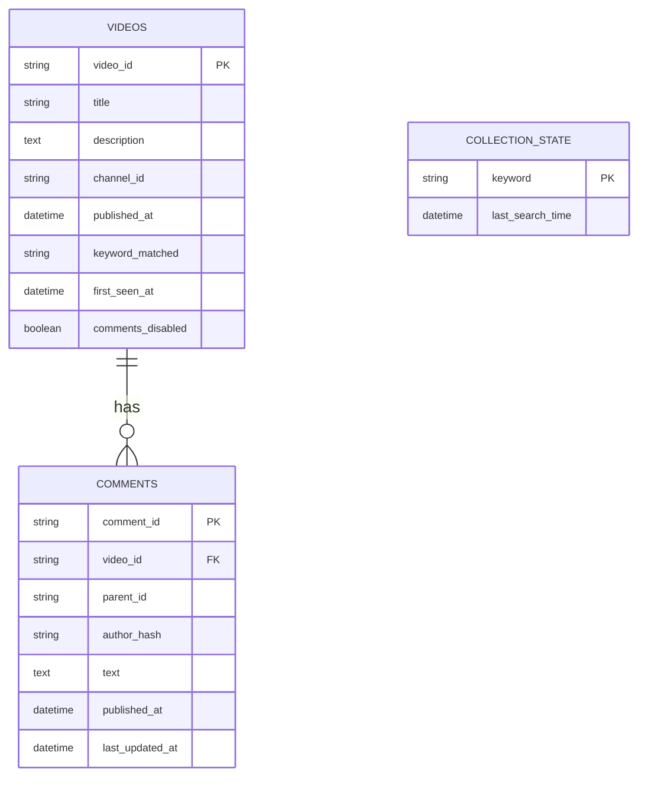

# Arc Raiders Sentiment Analysis Pipeline

### Project for CAP5771: Introduction to Data Science

## Project Overview

My project implements an end-to-end data engineering and NLP pipeline to track community sentiment for the video game **Arc Raiders** (developed by Embark Studios). By utilizing the YouTube Data API v3 and a State-of-the-Art (SOTA) Transformer model, I analyze how sentiment shifts in response to game updates, roadmaps (e.g., the 2026 Roadmap), and seasonal events.

The study period covers the game's launch (October 30, 2025) through the present, providing a longitudinal view of community reception.

---

## Repository Structure

```text
arc-raiders-sentiment/
├── data/                   # (Git-ignored) Stores SQLite DB and CSV exports
├── collection_log.txt      # (Git-ignored) Pipeline execution logs
├── src/                    # Source Code for Data Acquisition
│   ├── __init__.py         # Package initialization
│   ├── database.py         # Phase 3: SQLAlchemy models & SQLite schema
│   ├── discovery.py        # Phase 2: Automated video discovery
│   └── collector.py        # Phase 2: Comment scraping
├── .env                    # (Git-ignored) YOUTUBE_API_KEY
├── .gitignore              # Ensures sensitive/large data is not pushed to GitHub
├── main.py                 # Pipeline orchestrator (Entry Point)
├── EDA.ipynb               # Jupyter Notebook that contains the data exploration
├── requirements.txt        # Project dependencies
└── README.md               # Project documentation

```

---

## Methodology & Progress

### Data Source: The YouTube Data API v3

The primary data for this study was retrieved using the YouTube Data API v3, a RESTful interface provided by Google that allows for the systematic collection of video metadata and user-generated comments. For this project, the API was leveraged to perform **keyword-based discovery** of Arc Raiders content and to conduct deep-crawl extractions of **associated comment threads** for sentiment analysis.

In the current landscape of computational social science, the YouTube Data API represents a critical resource, as it remains one of the last prominent, high-fidelity social media APIs accessible to researchers without the prohibitive costs or restrictive access tiers recently implemented by platforms such as X (formerly Twitter) and Reddit.

### Data Engineering (Phases 2-3)

* **Incremental Discovery:** Implemented a state-aware search logic that tracks `last_search_time` to avoid redundant API calls and manage daily quotas.
* **Data Privacy (Ethics):** As I am planning to work towards an article, all user identifiers are anonymized using **SHA-256 hashing** (`author_hash`) before storage to ensure data minimization.
* **Database Infrastructure:** Built a relational SQLite schema using SQLAlchemy to handle video-comment relationships and maintain search state. Implemented 2-layer deduplication (Memory Set + DB Unique Constraints).

#### ER Diagram



### Data Exploration (Phase 4)

* **Loading the database:** SQL Joins were performed on the stored data to load into CSVs.

### Future Steps: Natural Language Processing

* **Model Selection:** Utilized `cardiffnlp/twitter-roberta-base-sentiment-latest`, a RoBERTa-base model fine-tuned on 124M tweets, providing superior nuance over lexicon-based methods like VADER.
* **Confidence Filtering:** Implementing a "Reject Option" based on **Softmax Probability** (Hendrycks & Gimpel, 2016). Only predictions with confidence > 0.70 are utilized for trend analysis to reduce noise.
* **Interaction Weighting:** To account for community consensus, a **Popularity-Weighted Sentiment** feature will be engineered:
$$\text{Weighted Score} = \text{Sentiment Label} \times \log(1 + \text{Like Count})$$

This prevents viral outliers from skewing trends while ensuring highly-voted community feedback is prioritized (Giachanou & Crestani, 2016).

---

## How to Run the Program

### 1. Prerequisites

* Python 3.10+
* A Google Cloud Project with the **YouTube Data API v3** enabled.
* An API Key.

### 2. Setup

1. **Clone the repository:**
```bash
git clone https://github.com/yourusername/arc-raiders-sentiment.git
cd arc-raiders-sentiment

```


2. **Install dependencies:**
```bash
pip install -r requirements.txt

```


3. **Configure Environment:**
Create a `.env` file in the root directory and add your key:
```text
YOUTUBE_API_KEY=your_actual_key_here

```


### 3. Execution

To run the full pipeline (Discovery -> Collection -> Analysis -> Plotting), execute the main orchestrator:

```bash
python3 main.py

```

---

## Expected Outputs

* **`arc_raiders_sentiment.db`**: A local database containing thousands of categorized comments.
* **`videos.csv`**:
* **`comments.csv`**:
* **`collection_log.txt`**: A detailed log of API quota usage and video discovery counts.
* **`sentiment_trend.png`**: A visualization showing the weekly sentiment fluctuations relative to the game's major milestones.
* **`arc_raiders_final_analysis.csv`**: A clean dataset ready for advanced modeling in Python.

---

## References

* **Guo, C., et al. (2017).** *On Calibration of Modern Neural Networks.* ICML. (Validation for Confidence Scoring).
* **Giachanou, A., & Crestani, F. (2016).** *Like It or Not: A Survey of Twitter Sentiment Analysis Methods.* ACM Computing Surveys. (Validation for Engagement Weighting).
* **Barbieri, F., et al. (2020).** *TweetEval: Unified Benchmark and Comparative Evaluation for Tweet Classification.* (Base for the RoBERTa model used).

---

*This project is submitted as part of the MS in Applied Data Science coursework at University of Florida. It adheres to YouTube API Terms of Service and ethical guidelines regarding public data collection.*
